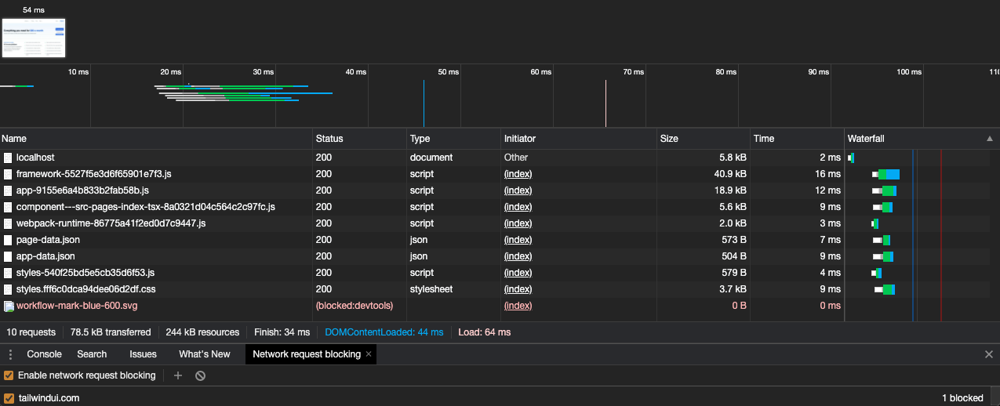
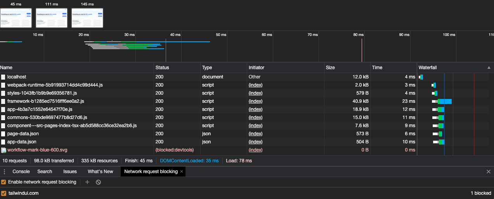

# Tailwind vs twin.macro

This repository is used to compare [`tailwind`](https://tailwindcss.com) with [`twin.macro`](https://github.com/ben-rogerson/twin.macro).
It uses `yarn` workspaces and `lerna` to hoist dependencies.

It consists of a simple index page and ten duplicated pages. This would let us understand (hopefully!) which technology to choose.

## Get started

Installing everything with `yarn`

```console
yarn install
```

There are two gatsby sites:
- `apps/tailwind`: contains the `tailwind` example. It runs on port 8000 in development mode and 9000 during serve.
- `apps/twin.macro`: contains the `twin.macro` example. It runs on port 8001 in development mode and 9001 during serve.

Enter one of the above folder and fire one of `develop`, `build` or `serve` commands.

## Styling techniques

| Type  | tailwind  | twin.macro
|---|---|---|
| global | [tailwind.css](./apps/tailwind/src/assets/tailwind.css)  | [Layout.tsx](./apps/twin.macro/src/components/Layout.tsx)  |
| classes  |  [index.tsx](./apps/tailwind/src/pages/index.tsx) | [index.tsx](./apps/twin.macro/src/pages/index.tsx)  |
| components  | [Button.tsx](./apps/tailwind/src/components/Button.tsx)  | [Button.tsx](./apps/twin.macro/src/components/Button.tsx)  |

## Results

### Chunks

Comparison done using unzipped chunks.

| `tailwind` | `twin.macro`
|---|---|
| <a href="./img/tailwind-chunks.png" target="_blank"></a> | <a href="./img/twin-macro-chunks.png" target="_blank"></a> |

### Lighthouse

| `tailwind` | `twin.macro`
|---|---|
| <a href="./img/tailwind-lighthouse.png" target="_blank"></a> | <a href="./img/twin-macro-lighthouse.png" target="_blank"></a> |

### HAR

| `tailwind` | `twin.macro`
|---|---|
| <a href="./img/tailwind-har.png" target="_blank"></a> | <a href="./img/twin-macro-har.png" target="_blank"></a> |
